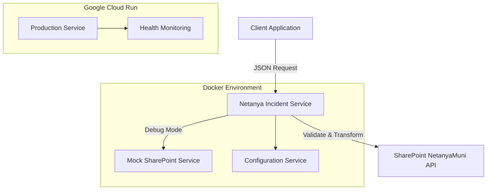
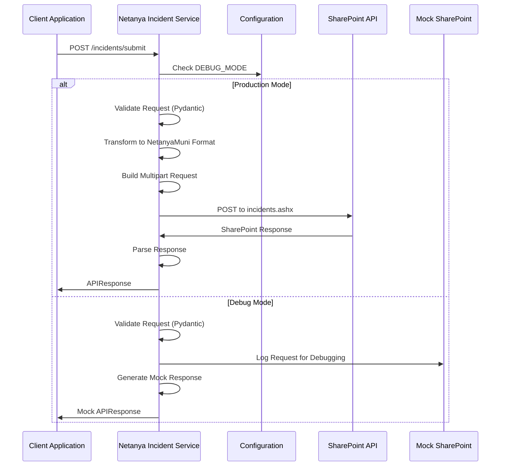
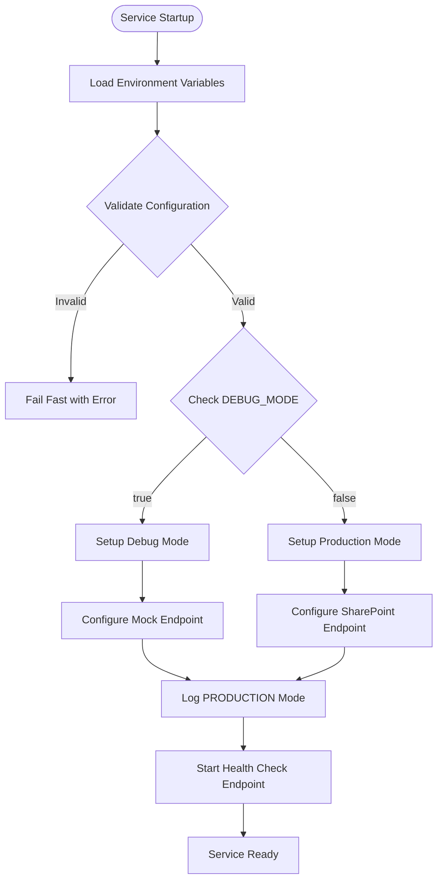
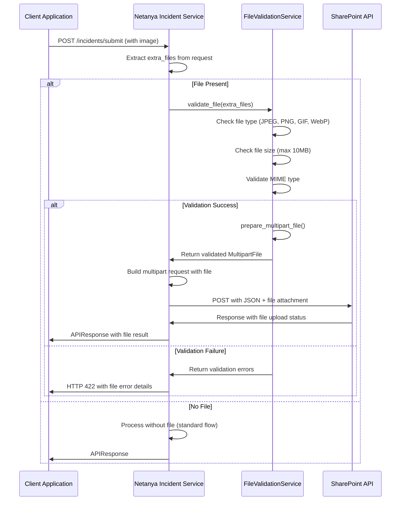

# Technical Design Document

## Overview

The Netanya Incident Service is a standalone FastAPI microservice that extracts municipality API integration functionality from the existing Python Streamlit client application. This service provides specialized incident submission capabilities for Netanya municipality through the official SharePoint-based incidents.ashx endpoint.

The service transforms internal method calls into REST API endpoints, enabling separation of concerns by isolating complex municipality API integration logic, headers management, and payload formatting from client applications. The microservice maintains exact compatibility with the existing NetanyaMuni SharePoint endpoint while providing modern API development patterns with automatic documentation and validation.

### Goals

- Extract submit_data functionality into independent, deployable microservice
- Maintain 100% compatibility with existing NetanyaMuni SharePoint API integration
- Provide Docker-first development and Google Cloud Run deployment capabilities
- Enable independent repository structure with complete separation from client application
- Implement FastAPI REST interface with automatic OpenAPI documentation
- Support debug/production mode switching for safe development and real municipality integration

### Non-Goals

- Modifying the existing client application's core functionality
- Changing the NetanyaMuni SharePoint API endpoint behavior or requirements
- Implementing user authentication or authorization within the service
- Creating database persistence for incident data (service acts as pass-through)
- Supporting file upload functionality in the initial implementation
- Integrating with other municipality services beyond the incidents endpoint

## Architecture

### High-Level Architecture



### Technology Stack and Design Decisions

#### Backend Framework Selection
- **Decision**: FastAPI with Pydantic validation
- **Context**: Need for modern Python web framework with automatic API documentation and validation
- **Alternatives**: Flask (familiar but manual validation), Django REST Framework (too heavy), Starlette (lower level)
- **Selected Approach**: FastAPI provides automatic OpenAPI documentation, built-in request/response validation, async support for better Cloud Run performance, and excellent developer experience
- **Rationale**: FastAPI's automatic documentation generation satisfies requirement 5.2, Pydantic validation handles requirement 5.4, and async support optimizes Cloud Run deployment costs
- **Trade-offs**: Learning curve vs proven Flask patterns, but gains modern API development features and Cloud Run optimization

#### Data Validation Strategy
- **Decision**: Pydantic models for request/response validation with copied dataclasses
- **Context**: Need to maintain exact compatibility with existing data models while adding REST API validation
- **Alternatives**: Manual validation (error-prone), Marshmallow (additional dependency), native dataclasses (no validation)
- **Selected Approach**: Convert existing dataclasses to Pydantic models for API validation while preserving structure and behavior
- **Rationale**: Ensures data consistency between client and service while adding robust validation and automatic schema generation
- **Trade-offs**: Model duplication vs type safety and automatic validation, but independence requirement necessitates copying

#### Container Orchestration Strategy
- **Decision**: Multi-stage Dockerfile with Docker Compose for local development
- **Context**: Requirement for local development with mock services and Cloud Run deployment optimization
- **Alternatives**: Single-stage Docker (larger images), Kubernetes (complex for single service), Docker Swarm (deprecated)
- **Selected Approach**: Multi-stage build with development and production stages, Docker Compose orchestrating service plus mock SharePoint
- **Rationale**: Optimizes container size for Cloud Run while providing complete local development environment with mock services
- **Trade-offs**: Build complexity vs deployment efficiency and development experience

#### API Documentation Security Strategy
- **Decision**: Restrict `/docs` endpoint to debug mode only, disable in production
- **Context**: Need for API documentation during development while maintaining production security
- **Alternatives**: Always enable (security risk), password protection (complexity), API key protection (additional auth layer)
- **Selected Approach**: Conditionally enable FastAPI's automatic documentation based on DEBUG_MODE environment variable
- **Rationale**: Provides full OpenAPI documentation for development and integration while eliminating information disclosure risks in production
- **Trade-offs**: No production documentation access vs enhanced security posture and reduced attack surface

## System Flows

### Incident Submission Flow



### Configuration and Environment Flow



### File Upload and Validation Flow



## Requirements Traceability

| Requirement | Requirement Summary | Components | Interfaces | Flows |
|-------------|-------------------|------------|------------|-------|
| 1.1-1.5 | Incident Submission Service | IncidentService, ValidationService | POST /incidents/submit | Incident Submission Flow |
| 2.1-2.5 | SharePoint Integration | SharePointClient, PayloadFormatter | SharePoint API calls | SharePoint Request Flow |
| 3.1-3.5 | Docker Development/Deployment | DockerConfig, HealthService | /health, Docker Compose | Container Startup Flow |
| 4.1-4.5 | Independent Repository | Project Structure, CI/CD | GitHub Actions | Deployment Pipeline |
| 5.1-5.8 | FastAPI REST Interface | FastAPI App, OpenAPI | /docs (debug only), /incidents/submit | API Documentation Flow |
| 6.1-6.6 | File Upload Support | FileValidationService, SharePointClient | Image validation, multipart files | File Upload Flow |
| 7.1-7.5 | Environment Configuration | ConfigService, ValidationService | Environment Variables | Configuration Flow |
| 8.1-8.5 | Mock SharePoint Service | MockSharePointService | Mock API endpoints | Debug Mode Flow |
| 9.1-9.5 | Debug/Production Modes | ModeManager, LoggingService | Mode switching logic | Mode Configuration Flow |

## Components and Interfaces

### API Layer

#### FastAPI Application
**Responsibility & Boundaries**
- **Primary Responsibility**: HTTP request/response handling and routing for incident submission endpoints with mode-aware documentation
- **Domain Boundary**: REST API interface layer between clients and business logic
- **Data Ownership**: Request/response validation and transformation, conditional API documentation exposure
- **Transaction Boundary**: Single HTTP request/response cycle

**Dependencies**
- **Inbound**: Client applications submitting incident data
- **Outbound**: IncidentService for business logic, ConfigService for configuration
- **External**: FastAPI framework, Pydantic for validation, Uvicorn ASGI server

**API Contract**
| Method | Endpoint | Request | Response | Errors |
|--------|----------|---------|----------|--------|
| POST | /incidents/submit | IncidentSubmissionRequest + Files | APIResponse | 400, 413, 422, 500 |
| GET | /health | None | HealthStatus | 503 |
| GET | /docs (debug only) | None | OpenAPI Schema | 404 (production) |

#### IncidentSubmissionRequest Schema
```typescript
interface IncidentSubmissionRequest {
  user_data: UserData;
  category: Category;
  street: StreetNumber;
  custom_text?: string;
  extra_files?: ImageFile; // Single image file
}

interface ImageFile {
  filename: string;
  content_type: string; // image/jpeg, image/png, image/gif, image/webp
  size: number; // File size in bytes
  data: string; // Base64 encoded file data
}

interface UserData {
  first_name: string;
  last_name: string;
  phone: string;
  user_id?: string;
  email?: string;
}

interface Category {
  id: number;
  name: string;
  text: string;
  image_url: string;
  event_call_desc: string;
}

interface StreetNumber {
  id: number;
  name: string;
  image_url: string;
  house_number: string;
}
```

### Business Logic Layer

#### IncidentService
**Responsibility & Boundaries**
- **Primary Responsibility**: Core incident submission logic and workflow orchestration
- **Domain Boundary**: Business logic for incident processing and submission coordination
- **Data Ownership**: Incident submission workflow state and validation results
- **Transaction Boundary**: Complete incident submission from validation through SharePoint response

**Dependencies**
- **Inbound**: FastAPI endpoints and request handlers
- **Outbound**: SharePointClient for external API calls, ValidationService for data validation
- **External**: None (pure business logic)

**Service Interface**
```typescript
interface IncidentService {
  submit_incident(request: IncidentSubmissionRequest): Result<APIResponse, ServiceError>;
  validate_submission(request: IncidentSubmissionRequest): Result<ValidationResult, ValidationError>;
  process_incident_with_file(request: IncidentSubmissionRequest, file?: ImageFile): Result<APIResponse, ServiceError>;
}
```

- **Preconditions**: Valid IncidentSubmissionRequest with required fields
- **Postconditions**: Returns either successful APIResponse with ticket ID or structured error response
- **Invariants**: Always validates input before processing, maintains audit trail of submission attempts

#### FileValidationService
**Responsibility & Boundaries**
- **Primary Responsibility**: Image file validation, processing, and multipart integration for SharePoint uploads
- **Domain Boundary**: File handling and validation logic for incident attachments
- **Data Ownership**: File validation rules, size limits, and MIME type checking
- **Transaction Boundary**: Single file validation and processing operation

**Dependencies**
- **Inbound**: IncidentService requesting file validation and processing
- **Outbound**: None (pure validation and processing logic)
- **External**: python-magic for MIME type detection, PIL/Pillow for image validation

**Service Interface**
```typescript
interface FileValidationService {
  validate_file(file: ImageFile): Result<ValidationResult, FileValidationError>;
  validate_file_type(content_type: string, data: bytes): Result<boolean, ValidationError>;
  validate_file_size(size: number): Result<boolean, ValidationError>;
  prepare_multipart_file(file: ImageFile): Result<MultipartFile, ProcessingError>;
}

interface MultipartFile {
  field_name: string; // "attachment"
  filename: string;
  content_type: string;
  data: bytes;
}
```

- **Preconditions**: Valid ImageFile with base64 encoded data
- **Postconditions**: Returns validated file ready for multipart inclusion or detailed validation errors
- **Invariants**: Maximum 10MB per file, supported image formats only (JPEG, PNG, GIF, WebP)

#### SharePointClient
**Responsibility & Boundaries**
- **Primary Responsibility**: SharePoint NetanyaMuni API integration and communication
- **Domain Boundary**: External API integration layer for municipality systems
- **Data Ownership**: SharePoint request/response formatting and error handling
- **Transaction Boundary**: Single SharePoint API call with retry logic

**Dependencies**
- **Inbound**: IncidentService requesting SharePoint submissions
- **Outbound**: External SharePoint NetanyaMuni incidents.ashx endpoint
- **External**: requests library for HTTP communication, secrets for boundary generation

**Service Interface**
```typescript
interface SharePointClient {
  submit_to_sharepoint(payload: APIPayload, file?: MultipartFile): Result<APIResponse, SharePointError>;
  build_multipart_request(payload: APIPayload, file?: MultipartFile): MultipartRequest;
  parse_sharepoint_response(response: HTTPResponse): Result<APIResponse, ParseError>;
}
```

- **Preconditions**: Valid APIPayload with all NetanyaMuni required fields, optional validated MultipartFile
- **Postconditions**: Returns parsed SharePoint response or detailed error information
- **Invariants**: Always includes required headers, uses WebKit boundary format, includes single file in multipart body if provided, handles response decompression

### Configuration Layer

#### ConfigService
**Responsibility & Boundaries**
- **Primary Responsibility**: Environment-based configuration management and validation
- **Domain Boundary**: Application configuration and environment-specific settings
- **Data Ownership**: Configuration values, defaults, and validation rules
- **Transaction Boundary**: Configuration loading and validation at startup

**Dependencies**
- **Inbound**: All services requiring configuration values
- **Outbound**: Environment variable system
- **External**: os.environ for environment variable access

**Service Interface**
```typescript
interface ConfigService {
  get_config(): Result<AppConfig, ConfigurationError>;
  validate_environment(): Result<void, ValidationError>;
  is_debug_mode(): boolean;
  get_sharepoint_endpoint(): string;
}

interface AppConfig {
  debug_mode: boolean;
  netanya_endpoint: string;
  environment: string;
  port: number;
  log_level: string;
}
```

- **Preconditions**: Environment variables available at startup
- **Postconditions**: Valid configuration object or fail-fast error
- **Invariants**: Configuration validated once at startup, immutable during runtime

#### MockSharePointService
**Responsibility & Boundaries**
- **Primary Responsibility**: Mock SharePoint endpoint for local development and testing
- **Domain Boundary**: Development and testing support services
- **Data Ownership**: Mock response generation and request logging
- **Transaction Boundary**: Mock request/response cycle with logging

**Dependencies**
- **Inbound**: SharePointClient during debug mode operation
- **Outbound**: Logging system for request/response tracking
- **External**: Flask framework for mock HTTP server (containerized separately)

**Service Interface**
```typescript
interface MockSharePointService {
  handle_mock_request(request: MultipartRequest): MockAPIResponse;
  log_request_details(request: MultipartRequest): void;
  generate_mock_ticket_id(): string;
}
```

- **Preconditions**: Valid HTTP request to mock incidents.ashx endpoint
- **Postconditions**: Realistic SharePoint-compatible response with logging
- **Invariants**: Always logs requests for debugging, generates consistent mock responses

## Data Models

### Domain Model

**Core Concepts**:
- **IncidentSubmission**: Complete incident submission with user data, category, and location
- **SharePointPayload**: NetanyaMuni-formatted payload for SharePoint API integration
- **APIResponse**: Standardized response format for client applications
- **ConfigurationContext**: Environment-specific configuration and mode settings

**Business Rules & Invariants**:
- All incident submissions must include required fields: callerFirstName, callerLastName, callerPhone1, houseNumber
- SharePoint payload must include fixed NetanyaMuni values: eventCallSourceId=4, cityCode="7400", etc.
- Debug mode responses must be consistent and never make external API calls
- Production mode must validate HTTPS endpoints and include proper headers

### Logical Data Model

**Structure Definition**:
- IncidentSubmissionRequest contains UserData, Category, StreetNumber with optional custom_text
- APIPayload transforms client data into NetanyaMuni SharePoint format with fixed municipality values
- APIResponse provides consistent format for both debug mock responses and production SharePoint responses
- Configuration hierarchy: Environment Variables → AppConfig → Service-specific settings

**Consistency & Integrity**:
- Request validation ensures all required fields present before processing
- Payload transformation maintains exact compatibility with existing NetanyaMuni integration
- Response parsing handles SharePoint JSON format with proper error handling
- Configuration validation enforces required environment variables at startup

### Data Contracts & Integration

**API Data Transfer**:
```typescript
// Request Schema (Pydantic validation)
interface IncidentSubmissionRequest {
  user_data: UserData;
  category: Category; 
  street: StreetNumber;
  custom_text?: string;
  extra_files?: Dict<string, any>;
}

// Response Schema (consistent format)
interface APIResponse {
  ResultCode: number;
  ErrorDescription: string;
  ResultStatus: string;
  data: string;
}

// SharePoint Integration Format
interface APIPayload {
  eventCallSourceId: number; // Fixed: 4
  cityCode: string; // Fixed: "7400"
  cityDesc: string; // Fixed: "נתניה"
  eventCallCenterId: string; // Fixed: "3"
  eventCallDesc: string; // From custom_text or category
  streetCode: string; // Fixed: "898"
  streetDesc: string; // Fixed: "קרל פופר"
  houseNumber: string; // From street.house_number
  callerFirstName: string; // From user_data
  callerLastName: string; // From user_data
  callerTZ: string; // From user_data.user_id
  callerPhone1: number; // From user_data.phone
  callerEmail: string; // From user_data.email
  contactUsType: string; // Fixed: "3"
}
```

**Cross-Service Data Management**:
- Service acts as stateless pass-through, no distributed transactions required
- Configuration loaded once at startup, immutable during runtime
- Mock service isolated in separate container for development environment
- All data validation happens at API boundary with Pydantic models

## Error Handling

### Error Strategy

The service implements structured error handling with specific responses for different error categories, comprehensive logging, and graceful degradation patterns for external dependencies.

### Error Categories and Responses

**User Errors (4xx)**:
- **Invalid Input (400)**: Missing required fields → Detailed field-level validation errors with correction guidance
- **Validation Failure (422)**: Invalid data format → Pydantic validation errors with specific field issues and expected formats
- **File Validation Failure (422)**: Invalid image files → Specific file validation errors with format, size, and type requirements
- **File Too Large (413)**: File exceeds size limit → Clear guidance on maximum file size (10MB)
- **Malformed Request (400)**: Invalid JSON structure → Clear JSON parsing error message with request format examples

**System Errors (5xx)**:
- **SharePoint API Failure (502)**: Municipality endpoint unavailable → Graceful degradation with retry suggestions and error correlation ID
- **Configuration Error (500)**: Missing environment variables → Clear configuration requirements with setup instructions
- **Network Timeout (504)**: SharePoint request timeout → Circuit breaker pattern with fallback to debug mode if available

**Business Logic Errors (422)**:
- **Required Field Missing**: NetanyaMuni validation → Clear indication of missing municipality-required fields
- **Invalid Municipality Data**: Payload format errors → Specific guidance on NetanyaMuni API requirements
- **Debug Mode Mismatch**: Production endpoint in debug mode → Mode configuration guidance and endpoint verification

### Monitoring

**Error Tracking**: Structured logging with correlation IDs for tracing requests through service components, integration with Cloud Run logging for production monitoring
**Health Monitoring**: `/health` endpoint with dependency checks for SharePoint connectivity, configuration validation, and service readiness
**Performance Monitoring**: Request/response timing, SharePoint API latency tracking, and Cloud Run resource utilization metrics

## Testing Strategy

### Unit Tests
- **Pydantic Model Validation**: Test all data model validation rules, edge cases, and error messages
- **File Validation Logic**: Test image file type validation, size limits, MIME type checking, and base64 decoding
- **Payload Transformation**: Verify correct APIPayload generation from IncidentSubmissionRequest with all field mappings
- **Configuration Loading**: Test environment variable parsing, defaults, and validation error scenarios
- **Mock Response Generation**: Validate consistent mock response format and timestamp generation
- **SharePoint Client Logic**: Test multipart request building with files, header construction, and response parsing

### Integration Tests
- **FastAPI Endpoint Integration**: End-to-end testing of /incidents/submit with valid and invalid payloads
- **Single File Upload Integration**: Test complete file upload flow with various image formats, sizes, and validation scenarios
- **Documentation Security Testing**: Verify /docs endpoint available in debug mode, returns 404 in production mode
- **Mock SharePoint Integration**: Verify complete flow through Docker Compose environment with mock service including file handling
- **Configuration Environment Testing**: Test different environment configurations (debug/production modes)
- **Error Handling Flows**: Test various error scenarios including file validation failures and proper error response formatting
- **Health Check Integration**: Verify /health endpoint with different service states and dependencies

### E2E Tests
- **Complete Incident Submission Flow**: Real client request through service to mock SharePoint with response validation
- **Image Upload End-to-End**: Test complete workflow with actual image files from client through to SharePoint including file processing
- **Debug Mode End-to-End**: Verify debug mode never makes external calls and returns consistent mock responses
- **Production Mode Flow**: Test production mode with actual NetanyaMuni integration (staging environment)
- **Docker Environment Testing**: Complete docker-compose environment testing with service orchestration
- **Cloud Run Deployment Testing**: Verify service deployment, health checks, and scaling behavior

### Performance Tests
- **Concurrent Request Handling**: Test FastAPI async performance with multiple simultaneous incident submissions
- **File Upload Performance**: Test service performance with large image files and concurrent single file uploads
- **SharePoint API Integration Load**: Verify service behavior under high load with external API rate limits
- **Container Startup Performance**: Test Docker container startup time and readiness probe timing
- **Memory Usage Profiling**: Validate Cloud Run memory efficiency and resource optimization including file processing memory usage
